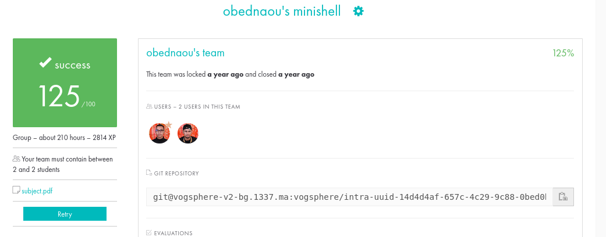

# 42_MINISHELL 💀


## About

This project is all about building a basic shell from scratch in the c language, like our own version of bash. As beginners in programming, it's been a steep learning curve. We've dived into processes, signal handling, file descriptors, and the core workings of shells. Minishell isn't just about coding; it's a journey back in time to understand the challenges before GUI existed. Along the way, we've embraced the struggle, immersed ourselves in documentation, and come out the other side with a deeper understanding and lots of bugs to fix.
Here is the link to the [subject](https://cdn.intra.42.fr/pdf/pdf/65357/en.subject.pdf)

## Team Members:

- [](https://github.com/oakoudad/badge42)

- [](https://github.com/oakoudad/badge42)

## Project Development:

- **Execution**: [Oussama Khiar](https://github.com/ossamakhiar) was primarily responsible for the execution part of the Minishell project. His tasks included implementing the builtin commands from scratch (such as echo, cd, pwd, export, unset, env, exit), managing process execution, handling file descriptors, managing signals, and ensuring seamless command execution by utilizing the parse tree generated by the parser.

- **Parsing**: [Omar Bednaoui](https://github.com/Stilram19) was primarily responsible for the parsing aspect of the Minishell project. His tasks involved tokenizing input, checking syntax errors, checking amibiguous redirections, managing heredocs, and generating a parse tree with comprehensive informations needed by the executer (including filename, filetype, command, command level, args, etc.).

By dividing tasks, we were able to focus on specific aspects of the project and collaborate effectively to achieve our goals.

## What We learned from this project:

During the development of this project, We've learned several important concepts including:

- **Teamwork**: Collaborating with team members, dividing tasks, and coordinating efforts to achieve project goals. It was the first group project from both of us.

- **Problem-Solving**: Throughout the development process, we encountered numerous challenges and setbacks. We experimented with various ideas, crafted multiple algorithms, many of which failed before we ultimately succeeded. This iterative approach allowed us to learn from each attempt, refine our strategies, and eventually overcome obstacles to achieve our objectives.

- **Error Handling**: Implementing robust error handling mechanisms to handle unexpected scenarios.

- **Debugging**: Learning to debug issues in your code effectively using debugging techniques.

## Minishell Preview:

https://github.com/Stilram19/minishell/assets/115463108/8ede38ca-a32a-4c61-abe4-3dd6c4b6a69d

# Our_42_project



## Installation && Usage

1. Install the GNU Readline library:
    For Debian, ubuntu, pop-os:

    ```bash
    sudo apt-get update
    sudo apt-get install libreadline-dev
    ```

2. Clone the repository to your local machine:

   ```bash
   git clone git@github.com:Stilram19/minishell.git
   ```

3. Navigate to the repository's directory:

    ```bash
    cd minishell
    ```

4. Compile and Run the program:

   ``` bash
   make run
   ```

   and start using the shell (See minishell preview video above)

## Resources (for students):

[manual](https://pubs.opengroup.org/onlinepubs/009695399/utilities/xcu_chap02.html)
